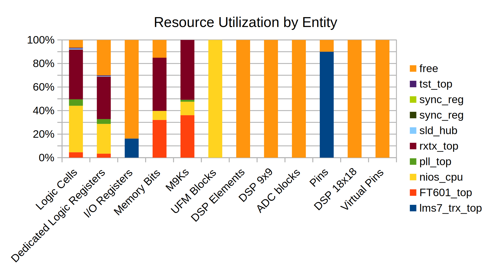

# LimeSDR-Mini FPGA gateware

This repository contains the FPGA gateware project for the LimeSDR-Mini board.

The gateware can be built with the free version of the Altera Quartus tools.

## Quartus Projects
### LMS7002 TRX
Resource Utilization on the Intel MAX 10 FPGA

To build a RX only project the focus should be spent on:

  * Removing unused elements in the NIOS II Interconnect
  * Removing the TX path in the RXTX block
  * Resizing memory elements in the FT601 block

## Branches

This repository contains the following hardware-specific branches:

* master:
  * Compiled gateware file for Hardware Revision 1v0 is LimeSDR-Mini_bitstreams/LimeSDR-Mini_lms7_trx_HW_1.0.pof.
* Other branches will be removed later.
  
## Licensing

Please see the COPYING file(s). However, please note that the license terms stated do not extend to any files provided with the Altera design tools and see the relevant files for the associated terms and conditions.
